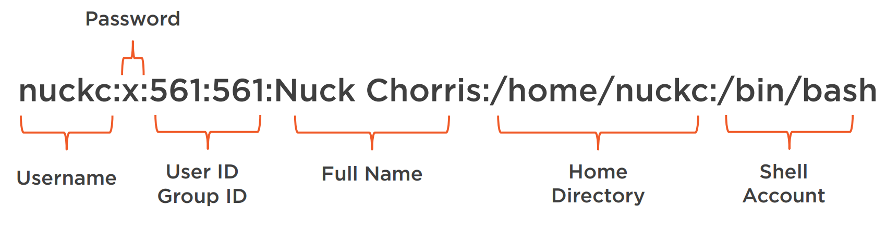

# Credential Access (TA0006)

## Credential Access with <mark style="color:red;">Mimikatz</mark>

Mimikats is a tool to extract plain text passwords, hashes, Kerberos tickets, and PIN codes from memory. In addition, Mimikatz can also used to pass the hash, pass the ticket, or create golden and silver tickets.

GitHub: https://github.com/gentilkiwi/mimikatz

MITRE ATT\&CK: https://attack.mitre.org/software/S0002/

### MITRE ATT\&CK Tactics

#### Persistence

* T1101: Security Support Provider

#### Credential Access

* T1098: Account Manipulation
* T1003: Credential Dumping
* T1081: Credentials in Files

### Credential dumping with Mimikatz

* Enable clear text passwords in Win10
  * HKLM\System\CurrentControlSet\C ontrol\SecurityProviders\Wdigest&#x20;
    * UseLogonCredential 1
* Create active login sessions
* Use basic Mimikatz commands to pull clear text passwords
  * privilege::debug
  * log \[filename]
  * sekurlsa::logonpasswords

## Credential Access with <mark style="color:red;">hashcat</mark>

Hashcat is the no. 1 offline password cracker. It supports different password-cracking techniques and many hash algorithms. What's more – it supports CPUs, GPUs, and other hardware accelerators on Linux, Windows, and macOS.

Hashcat is available at https://hashcat.net/

### MITRE ATT\&CK Tactics

#### Credential Access

* T1110: Brute Force

### Types of Attack

* Dictionary attack
* Dictionary attack with a rule
* Dictionary attack with a mask
* Cracking a password-protected PDF file
* Cracking a password-protected DOCX file

Probable Wordlists: https://github.com/berzerk0/Probable -Wordlists

pdf2john.pl, office2john.py (John the Ripper): https://www.openwall.com/john/

## Credential Access with <mark style="color:red;">Responder</mark>

A LLMNR, NBT-NS, and MDNS poisoner captures hashes and passwords from several protocols, such as SMB, MSSQL, HTTP, LDAP, FTP, etc.

Open source tool (GNU v3.0): https://github.com/lgandx/Responder

### MITRE ATT\&CK Tactics

#### Credential Access

* T1557: Man-in-the-Middle
  * T1557.001: LLMNR/NBT-NS Poisoning and SMB Relay
* T1040: Network Sniffing

Password Cracking Tools John-The-Ripper: https://github.com/magnumripper/ JohnTheRipper

Wordlists SecLists: https://github.com/danielmiessler/ SecLists

### Credential Access with <mark style="color:red;">Cain and Abel</mark>

Tooling for Microsoft operating systems designed for password recovery. Capable of cracking numerous types of encrypted passwords using Dictionary, Brute-Force, and Cryptanalysis attacks.

Available at the oxid.it site archive on the Wayback Machine: https://web.archive.org/web/20190616083719/http:// www.oxid.it/cain.html



### MITRE ATT\&CK Tactics

#### Credential Access

* T1014: Discovery
* T1110: Brute Force
  * T1110.002 Password Cracking

#### Command & Control

* T1219: Remote Access Software

### Usages

#### Enable reconnaissance of targeted network&#x20;

Crack WPA wireless network with Cain

* Perform Dictionary Attack against WPA network hash

Identify systems on the network to target

#### Perform a man-in-the-middle attack using Cain

* Sniff the network for credentials
* Leverage Cain’s ARP Poisoning feature

Used to exploit credentials transmitted across the network

Establish a foothold in the network to escalate the attack

#### Move laterally with Abel

* Access and control targeted system
* Leverage Abel remotely to send commands to the system

Used to access remote system credentials

Run commands on a remote system and expand foothold across the targeted network

#### Access system credentials with Cain

* Exploit the system to gather valuable credentials
* Perform Cryptanalysis Attack against NTLM hashes

Used to further access credentials on systems and move laterally

#### More Information

Password Lists: https://www.wirelesshack.org/wpawpa2-word-list-dictionaries.html

Rainbow Tables http://projectrainbowcrack.com/table.htm

### Credential Access with <mark style="color:red;">John the Ripper</mark>

A fast password cracker that is free and open source. Combines several cracking modes into one program, and it is fully configurable.

Support several hash formats such as:

* SHA-1, SHA-256, SHA-512
* MD5
* SSH Private Keys
* NTLMv1&2, Kerberos
* Much more.

### MITRE ATT\&CK Tactics

#### Credential Access

* T1003: Credential Dumping
* T1110: Brute Force
* T1212: Exploitation for Credential Access

### Cracking Modes

* Single
* Wordlist
* Incremental
* External
* Mask
* Markov

### Password Lists

Commonly used passwords Internet Repository of password lists

* Seclists
* Crackstation
* Weakpass

### Important files

* john.pot
* john.rec
* john.log
* /etc/passwd&#x20;
* /etc/shadow

### Passwd Files

<figure><figcaption></figcaption></figure>

### Shadow Files

<figure><figcaption></figcaption></figure>

GitHub: https://github.com/magnumripper/Joh nTheRipper/tree/bleeding-jumbo/doc

Common User Passwords Profiler: https://github.com/Mebus/cupp

Additional WordLists:

Crackstation https://crackstation.net/crackstationwordlist-password-crackingdictionary.htm Weakpass https://weakpass.com/wordlist

### Credential Access with <mark style="color:red;">THC Hydra</mark>

Used towards brute forcing of network logins. Powerful and fast parallel password cracking tool with a wide variety of supported network protocols.

Available at github.com/vanhouserthc/thc-hydra for download and compilation

### MITRE ATT\&CK Tactics

* Credential Access
  * T1110: Brute Force
    * T1110.001: Password Guessing
    * T1110.003: Password Spraying
    * T1110.004 Credential Stuffing

### Basics of hydra

* Brute force a website login
* Combining a list of usernames with a list of passwords
* Resuming an interrupted session
* Looping passwords around users
* Targeting RDP
* Using a proxy
* Leveraging debugging to identify problems

### Important Files

**Usernames**: A text file containing a listing of usernames pulled from Active Directory

**Passwords**: Shortlisting of passwords that are preferably targeted at the environment being tested.

### More Information

#### Word Lists

Probable Wordlists: github.com/berzerk0/ProbableWordlists

SecLists: github.com/danielmiessler/SecLists

Common User Passwords Profiler: github.com/Mebus/cupp

CeWL Custom Word List Generator: github.com/digininja/CeWL

### Credential Access with <mark style="color:red;">LaZagne</mark>

The LaZagne project is an open-source application used to retrieve lots of passwords stored on a local computer... developed to find passwords for the most commonly used software.

#### Post exploitation tool

* Written in Python
* Targets Windows, Linux, and Mac

#### Github repository

* https://github.com/AlessandroZ/LaZagne

#### Credentials from various software

* Browsers
* Admin tools
* Operating systems

#### Threat Groups

* APT3, APT33, MuddyWater, LeafMiner

### MITRE ATT\&CK Tactics

#### Credential Access

* T1552: Unsecured Credentials
  * T1552.001: Credentials in Files
* T1555: Credentials from Password Stores
  * T1555.003: Credentials from Web Browsers

### Popular Targets

* Windows/Linux/Mac: Chrome and Firefox
* Linux: SSH, FileZilla, AWS, KeePass 1 & 2, Thunderbird
* Windows: Outlook, VNC, RDPManager, OpenSSH, OpenVPN, Wireless network, Password hashes

### More Information

MITRE ATT\&CK: https://attack.mitre.org/software/S0349

Included as a module in Pupy: https://github.com/n1nj4sec/pupy
